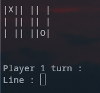

# TicTacToe-in-C
This is a tictactoe game made in c.
<br>
 
## How to play
Clone the project.
```bash
git clone https://github.com/xhjayoub/TicTacToe-in-C.git
```
Cd into the folder and compile main.c.
```bash
cd TicTacToe-in-C/
gcc main.c
```
Run a.out
```bash
./a.out
```
### Enjoy !